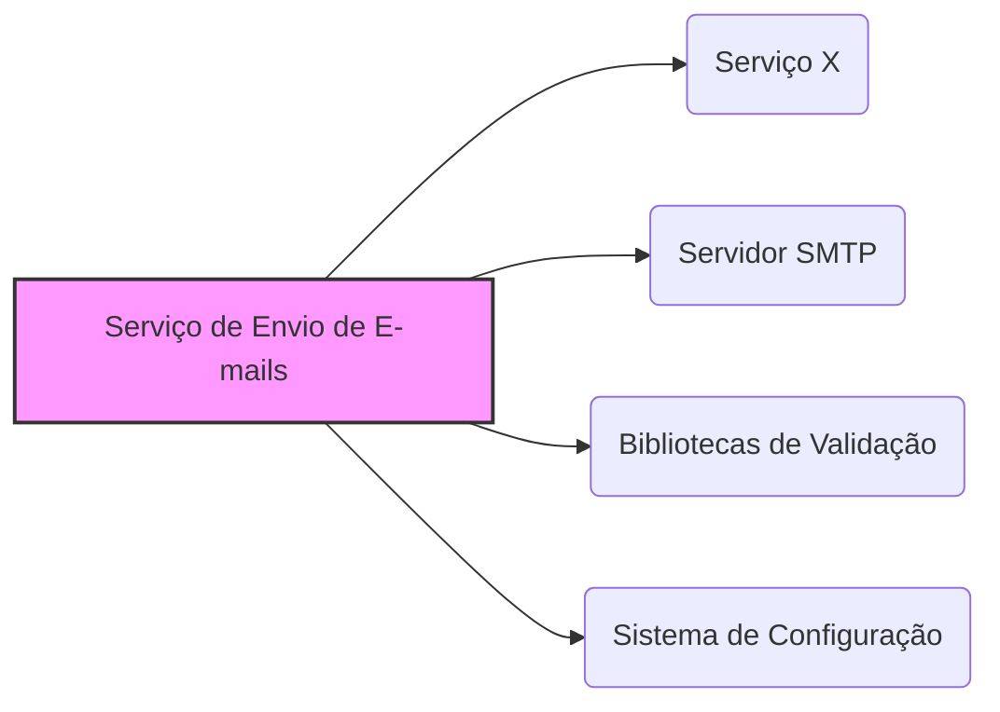
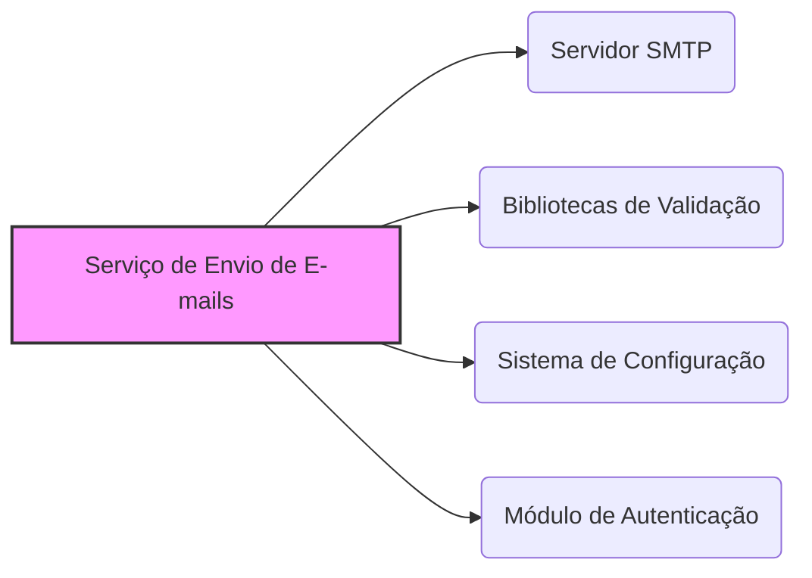

# analise_heuristicas_integracoes.md

## Análise Heurística de Integrações e Sugestões para o Serviço de Envio de E-mails

**Data:** 2024-02-29

**Autor:** Especialista em Análise de Sistemas

### 1. Introdução

Este documento apresenta uma análise detalhada das integrações, bibliotecas externas e APIs afetadas pela recente mudança no serviço de envio de e-mails, que removeu o acoplamento com o serviço X e aplicou o padrão Strategy nas verificações. O objetivo é fornecer um mapa claro das integrações e dependências, juntamente com sugestões de melhorias baseadas na alteração realizada.

### 2. Mapa de Integrações (Pré-Refatoração)

Antes da refatoração, o serviço de envio de e-mails provavelmente possuía as seguintes integrações:

*   **Serviço X:** Integração direta para alguma funcionalidade (autenticação, configuração, etc.). Detalhes específicos dependem do propósito do serviço X.
*   **Servidor SMTP:** Integração para envio de e-mails através de um servidor SMTP (Simple Mail Transfer Protocol).
*   **Bibliotecas de Validação:** Utilização de bibliotecas para validação de e-mails (e.g., `email-validator`).
*   **Sistema de Configuração:** Integração com um sistema de configuração para gerenciar as configurações do serviço (e.g., variáveis de ambiente, arquivos de configuração).

**Representação Visual:**

### 3. Mapa de Integrações (Pós-Refatoração)

Após a refatoração, as integrações foram modificadas da seguinte forma:

*   **Serviço X:** A integração direta foi removida. A funcionalidade antes provida pelo serviço X foi internalizada ou substituída.
*   **Servidor SMTP:** Continua sendo uma integração essencial para o envio de e-mails.
*   **Bibliotecas de Validação:** A utilização de bibliotecas de validação pode ser mantida dentro das estratégias de validação (e.g., `email-validator` dentro de `email_validator.py`).
*   **Sistema de Configuração:** Mantém-se a integração para gerenciar as configurações do serviço.
*   **Novo Módulo de Autenticação:** Introdução de um módulo de autenticação interno (`auth/authenticator.py`) que pode depender de outras bibliotecas ou serviços para autenticação, dependendo da implementação.

**Representação Visual:**

### 4. Análise Detalhada das Integrações e Dependências

#### 4.1. Serviço X (Removido)

*   **Impacto da Remoção:** A remoção do acoplamento com o serviço X traz os seguintes benefícios:
    *   **Independência:** O serviço de envio de e-mails torna-se independente do serviço X, reduzindo o risco de falhas em cascata e facilitando o deploy independente.
    *   **Manutenção:** A manutenção do serviço de envio de e-mails torna-se mais simples, pois não é necessário considerar as dependências do serviço X.
    *   **Testabilidade:** Os testes unitários tornam-se mais fáceis, pois não é necessário simular o comportamento do serviço X.
*   **Sugestões:**
    *   **Monitoramento:** Implementar monitoramento para garantir que a funcionalidade que antes era provida pelo serviço X (e agora foi internalizada) esteja funcionando corretamente.
    *   **Documentação:** Documentar claramente a nova implementação da funcionalidade que substituiu o serviço X.

#### 4.2. Servidor SMTP

*   **Considerações:** A integração com o servidor SMTP é crucial para o envio de e-mails. É importante garantir que a configuração do servidor SMTP seja flexível e fácil de alterar.
*   **Sugestões:**
    *   **Configuração Dinâmica:** Permitir a configuração dinâmica do servidor SMTP através de variáveis de ambiente ou arquivos de configuração.
    *   **Suporte a TLS/SSL:** Garantir o suporte a TLS/SSL para proteger a comunicação com o servidor SMTP.
    *   **Múltiplos Servidores SMTP:** Considerar a possibilidade de configurar múltiplos servidores SMTP para aumentar a resiliência e a capacidade de envio.
    *   **Monitoramento:** Monitorar a conectividade e o desempenho do servidor SMTP.

#### 4.3. Bibliotecas de Validação

*   **Considerações:** A utilização de bibliotecas de validação (e.g., `email-validator`) pode simplificar a implementação das estratégias de validação.
*   **Sugestões:**
    *   **Escolha da Biblioteca:** Escolher uma biblioteca de validação bem mantida e com boa cobertura de testes.
    *   **Integração com o Padrão Strategy:** Integrar as bibliotecas de validação dentro das classes de estratégia de validação.
    *   **Validação Customizada:** Permitir a implementação de validações customizadas para atender a requisitos específicos.

#### 4.4. Sistema de Configuração

*   **Considerações:** Um sistema de configuração robusto é essencial para gerenciar as configurações do serviço de envio de e-mails.
*   **Sugestões:**
    *   **Utilizar Variáveis de Ambiente:** Utilizar variáveis de ambiente para configurar o serviço em diferentes ambientes (desenvolvimento, teste, produção).
    *   **Arquivos de Configuração:** Utilizar arquivos de configuração (e.g., YAML, JSON) para configurações mais complexas.
    *   **Bibliotecas de Configuração:** Considerar o uso de bibliotecas como `pydantic` ou `dataclasses` para definir e validar as configurações do serviço.
    *   **Centralização:** Se houver vários serviços, centralizar a configuração (e.g., com Hashicorp Vault ou AWS Secrets Manager) para facilitar a gestão.

#### 4.5. Módulo de Autenticação

*   **Considerações:** O módulo de autenticação é responsável por autenticar o serviço de envio de e-mails. A implementação depende dos requisitos de segurança e da infraestrutura disponível.
*   **Sugestões:**
    *   **Implementação Segura:** Implementar a autenticação de forma segura, utilizando senhas fortes e armazenando-as de forma criptografada.
    *   **Múltiplos Métodos de Autenticação:** Considerar a possibilidade de suportar múltiplos métodos de autenticação (e.g., usuário/senha, tokens API, OAuth).
    *   **Rotação de Credenciais:** Implementar um sistema de rotação de credenciais para aumentar a segurança.
    *   **Auditoria:** Implementar auditoria para rastrear as tentativas de autenticação e identificar possíveis ataques.
    *   **Integração com IdP:** Se aplicável, integrar com um Identity Provider (IdP) para autenticação centralizada.

### 5. Análise das Bibliotecas Externas

A escolha das bibliotecas externas deve ser feita com cuidado, considerando os seguintes fatores:

*   **Popularidade e Manutenção:** Escolher bibliotecas populares e bem mantidas, com uma comunidade ativa.
*   **Licença:** Verificar a licença da biblioteca para garantir que ela seja compatível com os requisitos do projeto.
*   **Segurança:** Verificar se a biblioteca possui vulnerabilidades conhecidas.
*   **Desempenho:** Avaliar o impacto da biblioteca no desempenho do serviço.
*   **Tamanho:** Evitar bibliotecas muito grandes que podem aumentar o tamanho do deploy.

**Exemplos de Bibliotecas:**

*   `email-validator`: Para validação de endereços de e-mail.
*   `pydantic`: Para definição e validação de configurações.
*   `requests`: Para fazer requisições HTTP (se necessário para o módulo de autenticação).
*   `python-dotenv`: Para carregar variáveis de ambiente de um arquivo `.env`.

### 6. Sugestões Gerais

*   **Testes Automatizados:** Implementar testes unitários, testes de integração e testes de ponta a ponta para garantir a qualidade do serviço.
*   **Logging:** Implementar logging para rastrear o fluxo de execução e facilitar a depuração.
*   **Monitoramento:** Implementar monitoramento para identificar problemas de desempenho e disponibilidade.
*   **Documentação:** Documentar a arquitetura, as integrações e as configurações do serviço.
*   **Integração Contínua/Entrega Contínua (CI/CD):** Automatizar o processo de build, teste e deploy do serviço.
*   **Segurança:** Realizar análises de segurança para identificar e corrigir vulnerabilidades.
*   **Infraestrutura como Código (IaC):** Utilizar IaC para provisionar e gerenciar a infraestrutura do serviço.
*   **Observabilidade:** Além de logging e monitoramento, implementar tracing para entender o fluxo das requisições através do serviço.

### 7. Conclusão

A refatoração do serviço de envio de e-mails, com a remoção do acoplamento com o serviço X e a aplicação do padrão Strategy, trouxe benefícios significativos em termos de independência, extensibilidade, testabilidade e manutenibilidade. A análise detalhada das integrações e dependências, juntamente com as sugestões de melhorias apresentadas, pode aprimorar ainda mais a qualidade, a segurança e a robustez do serviço. É crucial continuar investindo em testes automatizados, monitoramento e documentação para garantir o sucesso a longo prazo do serviço de envio de e-mails.